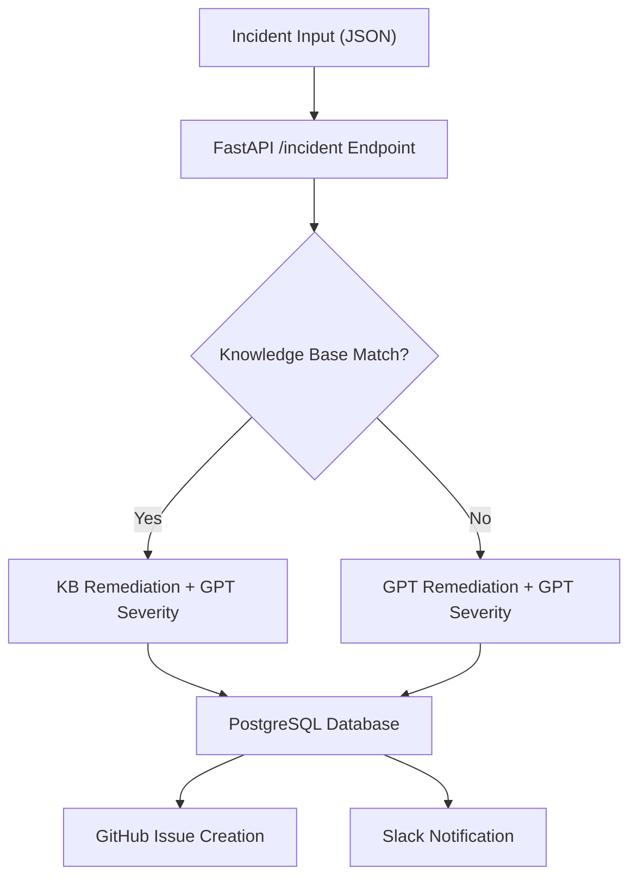

# Incident Agent: AI-Powered Incident Management Pipeline

## Introduction

This project implements an **AI-powered incident management pipeline** that automates the classification, remediation suggestion, and tracking of IT incidents.

The system:
- Accepts incident reports via a REST API
- Classifies severity (**High / Medium / Low**) using GPT
- Suggests remediation steps from a **Knowledge Base (KB)** or GPT as fallback
- Stores incidents in a **PostgreSQL database**
- Creates a **GitHub Issue** for each incident
- Sends an alert to a **Slack channel**

Key design goals:
- **Modularity** → easily extensible (e.g., Jira, vector DBs)
- **Practicality** → integrates with widely used tools (GitHub, Slack, Postgres)
- **Reliability** → KB-first ensures consistency, GPT covers unknowns

---

## Development Path

- Initial prototype in **Jupyter Notebook** tested GPT classification with PostgreSQL
- Migrated to **FastAPI** for REST endpoints, scalability, and integrations
- Extended functionality step by step:
  1. PostgreSQL persistence
  2. GPT-only classification
  3. Hybrid **KB-first with GPT fallback**
  4. GitHub Issue creation
  5. Slack notifications

---

## Architecture

The pipeline follows a modular architecture where each component has a specific role but integrates seamlessly with the others.

### Flow Diagram



### Process Flow

1. **Incident Input** → POST /incident accepts type and description
2. **KB Lookup** → TF-IDF similarity vs kb.csv
   - If above threshold (0.35), remediation comes from KB
   - Otherwise GPT generates remediation
3. **Severity** is always classified by GPT
4. **Database** → All incidents stored in PostgreSQL
5. **GitHub** → Issue automatically created with incident details
6. **Slack** → Notification posted in #incidents channel

---

## Setup Instructions

### 1) Clone Repository

```bash
git clone https://github.com/aaryanb090/incident-agent.git
cd incident-agent
```

### 2) Create Virtual Environment

```bash
python -m venv venv

# Windows
venv\Scripts\activate

# Linux/macOS
source venv/bin/activate
```

### 3) Install Dependencies

```bash
pip install -r requirements.txt
```

`requirements.txt`:
```
fastapi
uvicorn[standard]
sqlalchemy
psycopg2-binary
httpx
openai
pydantic
pandas
scikit-learn
python-dotenv
```

### 4) PostgreSQL Setup

```sql
CREATE DATABASE incidentdb;
```

The `incidents` table is created automatically at runtime.

### 5) Knowledge Base

Create `kb.csv` in the project root:

```csv
problem,remediation
database connection error,Restart DB service and verify credentials/network. Check pg_hba.conf and firewall.
high cpu usage,Identify top processes; restart offending service; scale CPU allocation.
service timeout,Check downstream service health; increase client/server timeouts; add retries.
authentication timeout,Verify IdP health; increase auth timeout; warm caches; check rate limits.
disk full,Free space; rotate logs; increase volume; add alerts for 80%+ usage.
```

### 6) Configure API Keys

In `main.py`, update:

```python
DATABASE_URL = "postgresql://<user>:<password>@localhost:5432/incidentdb"
OPENAI_API_KEY = "sk-xxxx"
GITHUB_TOKEN = "ghp_xxxx"
GITHUB_REPO = "<username>/incident-tracker"
SLACK_BOT_TOKEN = "xoxb-xxxx"
SLACK_CHANNEL = "#incidents"
```

### 7) Run Application

```bash
uvicorn main:app --reload
```

Expected console log:
```
✅ KB loaded with 5 entries
INFO:     Uvicorn running on http://127.0.0.1:8000
```

### 8) Access API

- **Swagger UI**: http://127.0.0.1:8000/docs

Example request:
```bash
curl -X POST "http://127.0.0.1:8000/incident" \
  -H "Content-Type: application/json" \
  -d '{"incident_type": "Login Failure", "description": "Users cannot log in due to authentication timeout"}'
```

---

## Demo Walkthrough

### 1. Trigger Incident

Via Swagger or curl.

Example input:
```json
{
  "incident_type": "Login Failure",
  "description": "Users cannot log in due to authentication timeout"
}
```

### 2. AI Classification & Remediation

Example response:
```json
{
  "id": 10,
  "incident_type": "Auth Error",
  "description": "Users cannot log in due to authentication timeout",
  "severity": "High",
  "remediation": "Verify IdP health; increase auth timeout; warm caches; check rate limits.",
  "created_at": "2025-09-27T11:47:42.004892",
  "github_issue": "https://github.com/<user>/incident-tracker/issues/4",
  "kb_used": true,
  "kb_score": 1.0
}
```

### 3. Verification

- **Database Persistence** → Confirm new row in `incidents` table
- **GitHub Issue** → Verify new issue in configured repo
- **Slack Notification** → Check message in #incidents channel

This demonstrates end-to-end functionality.

---

## Trade-offs & Assumptions

- **Environment** → Jupyter discarded in favor of FastAPI for scalability
- **Database** → PostgreSQL chosen over NoSQL for structured schema
- **Classification** → GPT handles severity, KB-first handles recurring remediation
- **Threshold** → Set at 0.35 for flexibility; higher values improve precision but reduce recall
- **Integrations** → GitHub chosen over Jira for simpler setup; Slack kept in plain text
- **Security** → Keys hardcoded for demo speed; should use env vars in production
- **Scalability** → TF-IDF adequate for small KB; embeddings/vector DBs are future options
- **Scope** → Only incident creation covered; update/close workflows excluded
